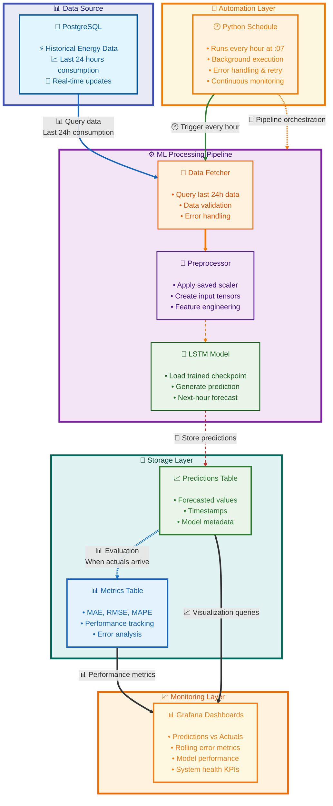

# ⚡️ Pulse  

**Pulse** is a machine learning pipeline that forecasts **hourly energy consumption** using a custom-trained LSTM model.  
It stores results in PostgreSQL, runs automatically on a schedule, and visualizes predictions in Grafana dashboards.  

---

## ✨ Features  
- 🧠 **Custom LSTM model** trained on ~4 years of historical data (not a premade model)  
- ⏳ **Forecasts**: Uses the last 24 hours to predict the next 1 hour  
- 🔄 **Automated pipeline**: Runs every hour (at minute 7)  
- 🗄️ **PostgreSQL integration**: Saves predictions, actuals, and error metrics (MAE, RMSE, MAPE)  
- 📊 **Visualization**: Grafana dashboards to monitor predictions and accuracy  

---

## ⚙️ How it works  
1. Fetch latest data from the database  
2. Preprocess with the same scaler used during training  
3. Load the saved LSTM checkpoint (`best_energy_model.pth`)  
4. Predict next-hour consumption  
5. Store results and metrics in PostgreSQL  
6. Visualize everything in Grafana  

---

## 🏋️ Model Training  
The LSTM model was trained **offline** on ~4 years of energy consumption data.  

- Framework: **PyTorch**  
- Input: 24h sliding window  
- Output: Next 1h forecast  
- Best checkpoint: `best_energy_model.pth`  

Training scripts and configs are included in the repo for reproducibility.  

---

## 📊 Dashboards  
Pulse provides **Grafana-powered dashboards**:  
- Predictions vs. actuals  
- Rolling error metrics (MAE, MAPE)  

---

## 🏗️ Architecture  

1. **Energy Forecasting Pipeline**  
   - **ETL Workflow**: Extract → Preprocess (scaling & sliding windows) → Forecast → Store  
   - **Automated Scheduling**: Hourly execution at minute 7 with error handling  
   - **PostgreSQL Integration**: Predictions + actuals + evaluation metrics stored for analysis  

2. **Model Serving & Inference**  
   - **Pre-Trained LSTM Model**: Custom-trained on ~4 years of historical data  
   - **Inference-Only Runtime**: Model checkpoint (`best_energy_model.pth`) loaded for forecasts  
   - **Evaluation Layer**: MAE, RMSE, MAPE calculated when actuals arrive  

3. **Production-Ready Infrastructure**  
   - **Dockerized Services**: Database, pipeline, and Grafana dashboards packaged as containers  
   - **Persistent Volumes**: Durable storage for models, scaler, and database data  
   - **Health & Monitoring**: Logs, metrics, and dashboards for system reliability  

4. **Scalable & Maintainable Design**  
   - **Separation of Concerns**: Independent modules for training, inference, database I/O, and scheduling  
   - **Database Connection Pooling**: Efficient queries and inserts  
   - **Reusable Components**: Modular codebase with configs for easy retraining and redeployment  

---

## 🛠️ Technology Stack  

### Core Technologies  
- **Python 3.11** – Modern runtime for model training and inference  
- **PostgreSQL 15** – Relational database for predictions, actuals, and metrics  

### Machine Learning & Data Processing  
- **PyTorch** – Deep learning framework for the LSTM model  
- **pandas** – Data manipulation and preprocessing  
- **scikit-learn** – MinMaxScaler for normalization  

### Automation & Scheduling  
- **schedule** – Lightweight job scheduling for hourly pipeline runs  
- **cron (via scheduler.py)** – Automated pipeline execution  

### Monitoring & Visualization  
- **Grafana** – Dashboards for predictions and evaluation metrics  
- **Python logging** – Application-level logging  
- **traceback** – Error tracking and debugging  

### DevOps & Deployment  
- **Docker** – Containerization for portability  
- **Docker Compose** – Multi-service orchestration (pipeline + database + Grafana)

- ## Performance Overview

### Lab (Historical Test)
- **MAE** ≈ 466 MWh  
- **RMSE** ≈ 704 MWh  
- **MAPE** ≈ 1.14% — strong performance on in-distribution data.

  

  

  

### Live Production (Aug 29–30 Run)
- MAPE stayed low (~5%) initially but **spiked above 20%** around Aug 30, before settling to elevated levels (~5–15%).
- This reflects **real-world anomalies**—such as abrupt demand drops or unexpected events—not represented in training data.
  
  
## Grafana Dashboards

  

  

